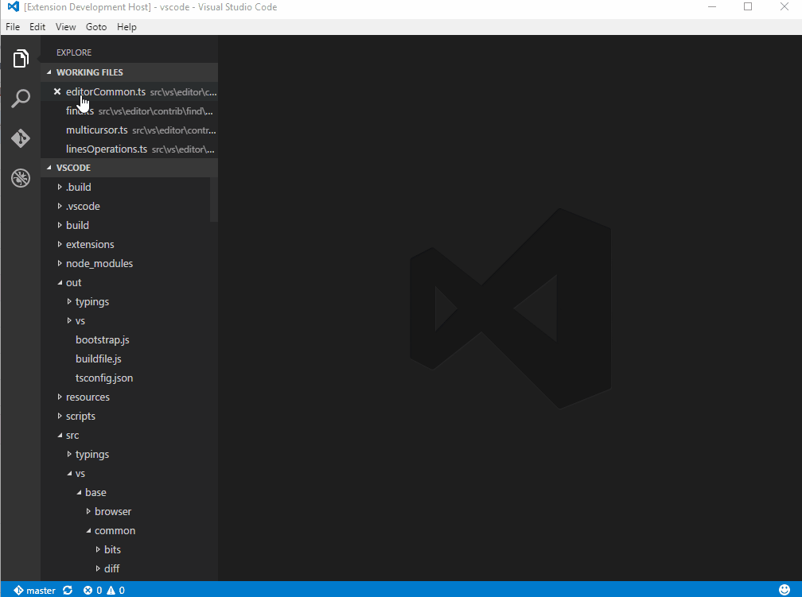

# It should be at core

Gotchas, Insights and helpful features. Remember files, back actions (after go to definition for example), etc...

## Features

### Remember list of openned files

This feature is automatically triggered.
When you close the current file, the default behaviour of VSCode is to close de editor and show a black window.
This is specially painful when you use F12 (go to definition) repeatedly and whant to go back to the last file.
With this feature enabled, just close the actual file and the last one will be oppened.
